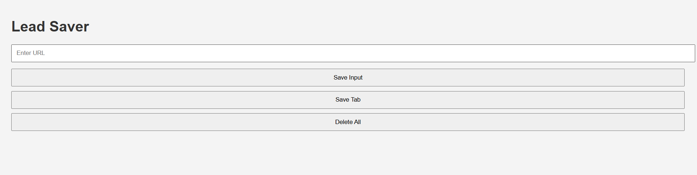

# 🧩 Lead Saver - Chrome Extension

This is a simple Chrome Extension built as part of the **Scrimba JavaScript** course.

It helps you **save useful links** (leads) while browsing with one click.

---

## 🔍 Features
- Save input URL manually
- Save the current active tab's URL
- Delete all saved leads (on double click)
- Data is stored in local storage

---

## 📸 Preview



---

## 🛠 Technologies Used
- HTML
- CSS
- JavaScript
- Chrome Extension API

---

## ▶️ How to Use

1. Clone or download this repo.
2. Go to `chrome://extensions` in your browser.
3. Enable **Developer Mode** (top right).
4. Click **Load Unpacked**.
5. Select the `chrome-extension` folder.

---

## 📁 Project Structure
```
chrome-extension/
├── index.html
├── style.css
├── script.js
├── manifest.json
└── screenshot.png
```

---

✅ Built by [Jaber Abu Zarqa](https://github.com/jaber2003)
